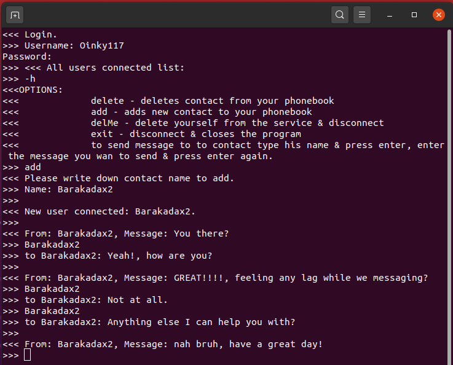
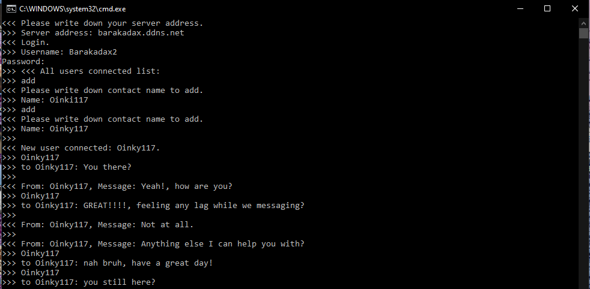

# Silent messaging
Chat server & client for messaging. 
The service uses 2 factor authentication, login & Diffie Hellman. 
The server & each client gets each run an asymmetrical encryption only sharing its public key. 
 
Messages sent from unknown contact will not be shown on client screen & straight deleted from the memory. 
Service keeps metadata only about attempts of failed login so it can be checked out as an attack on the service. 
The messages are not saved anywhere & encrypted per each client so the server itself can't read them, 
 
this method used against man in the middle attack. 
Using also regex against sql injection. 
You get 3 types of users so it can be managed better. 
The service can run WAN & LAN alike. 
Server can be also blocked from itself & client can block itself from running when some actions accured. 
The server always checks up user connection so if the user brut existed the service without disconnecting it will disconnect him. 
Uses UTF-8 so on supported environments you can type on any language & use emojis. 